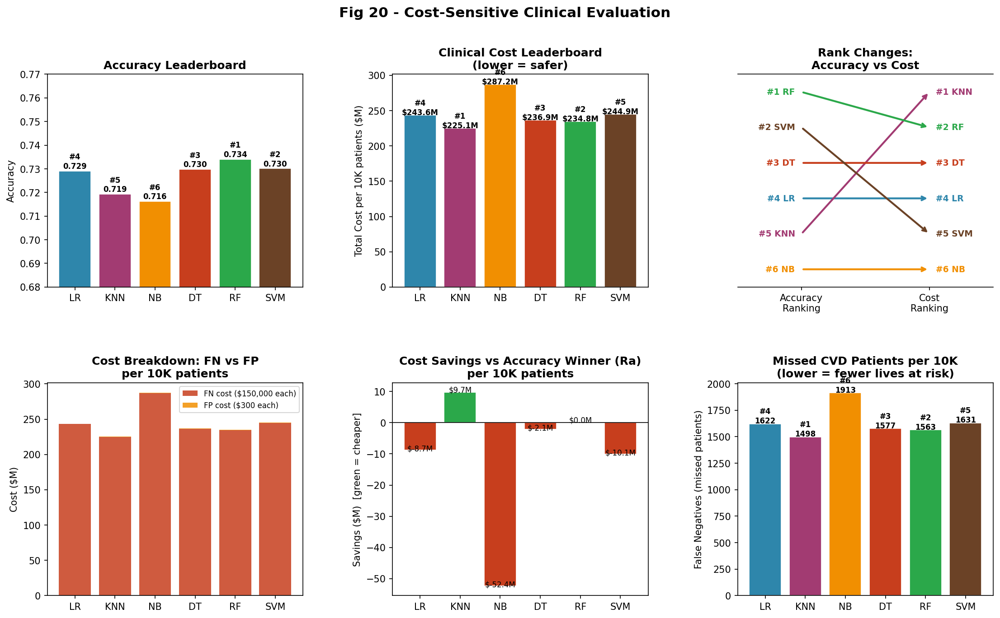
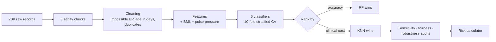

<div align="center">

# Beyond Accuracy

**Choosing a heart-disease classifier by what its mistakes actually cost**


</div>

> **TL;DR:** Random Forest is the most accurate of six models. KNN places 5th of 6 on accuracy, yet ranked by real clinical cost it wins: it misses **65 fewer sick patients per 10,000** and saves **$9.7M**. The ranking holds for every cost assumption from $25K to $200K.

<br>

## The problem

A primary-care doctor has about 15 minutes to decide whether to refer a patient to a cardiologist or send them home. The two possible mistakes are not equal:

| Mistake | What happens | Estimated cost |
|:--|:--|--:|
| **False negative** | Sick patient sent home; possible heart attack, ER visit, surgery | **$150,000** |
| **False positive** | Healthy patient gets an unnecessary referral | **$300** |

That's a **500 : 1** asymmetry. Accuracy treats both errors the same, which makes it the wrong way to pick a model here.

## Results

| Model | Accuracy | AUC | Recall | Missed / 10K | **Cost / 10K** | Accuracy rank → **Cost rank** |
|:--|--:|--:|--:|--:|--:|:-:|
| Random Forest | **0.734** | **0.801** | 0.684 | 1,563 | $234.8M | #1 → #2 |
| SVM (RBF) | 0.730 | 0.789 | 0.670 | 1,631 | $244.9M | #2 → #5 |
| Decision Tree | 0.730 | 0.790 | 0.681 | 1,577 | $236.9M | #3 → #3 |
| Logistic Regression | 0.729 | 0.793 | 0.672 | 1,622 | $243.6M | #4 → #4 |
| **KNN** | 0.719 | 0.774 | **0.697** | **1,498** | **$225.1M** | #5 → **#1** |
| Naive Bayes | 0.716 | 0.781 | 0.613 | 1,913 | $287.2M | #6 → #6 |

<p align="center"></p>

**Other findings**
- **3 features are enough.** Blood pressure, cholesterol and age recover 99.5% of full-model accuracy, which suits a 15-minute visit.
- **Fair.** All six models pass a gender fairness audit.
- **Robust.** Five of six models hold up under 20% measurement noise (the decision tree doesn't).

## How it works



| Step | Script |
|:--|:--|
| Load and inspect (found a BP of 16,020 mmHg and heights of 250 cm) | `phase1_loading.py` |
| Clean and engineer features | `phase2_cleaning.py`, `phase4_features.py` |
| Exploratory analysis | `phase3_eda.py` |
| Train and compare 6 models | `phase5a_models.py`, `phase5b_viz.py` |
| Cost re-ranking and sensitivity | `phase6_cost.py` |
| Minimal feature set | `phase7_features.py` |
| Fairness and robustness audit | `phase8_fairness.py` |
| Interactive risk calculator | `phase9_calculator.py`, `live_calculator.py` |

## Quickstart

```bash
pip install pandas numpy scikit-learn matplotlib seaborn
# Download cardio_train.csv (Kaggle: "Cardiovascular Disease dataset" by Sulianova) into this folder
for p in phase*.py; do python "$p"; done
python live_calculator.py          # score your own patient
```

## What I'd do next

- **Threshold tuning over model choice.** Moving each model's decision threshold toward the 500:1 cost ratio would probably beat switching models.
- **Calibrated probabilities** (isotonic or Platt) so the calculator's risk bands can be trusted.
- **Real cost data.** The $150K false-negative cost is an estimate; claims data would make the analysis defensible.

<br>

<sub>📄 Full write-up: <a href="report/CVD_Project_Report.pdf">report/CVD_Project_Report.pdf</a> · Boston University MET CS 577, Data Science with Python, Spring 2026</sub>
